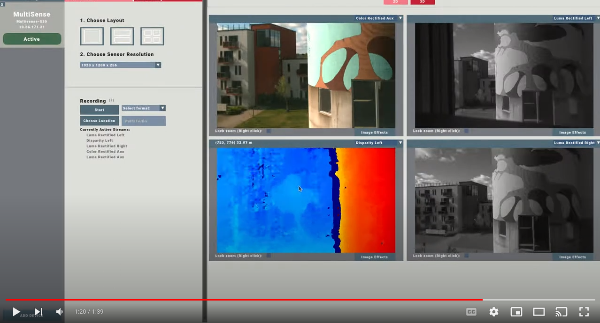

# MultiSense Viewer

<!---
   -->

| Platform | CI Status                                                                                                                                                         |
|----------|:------------------------------------------------------------------------------------------------------------------------------------------------------------------|
| Linux    |  |
| Windows  |        |

## Background

Quickly test your MultiSense device by using this application. The application will automatically find the camera and
configure your network adapter. Additionally, the app provides a rich 2D/3D viewer and options to control sensor
parameters.

## Installation

### Ubuntu:

Head over to releases https://github.com/M-Gjerde/MultiSense/releases, download and install the deb package from the
latest release. Tested on Ubuntu 20.04 and 22.04

### Windows

Head over to releases https://github.com/M-Gjerde/MultiSense/releases, download and run the windows installer from the
latest release. Tested on Windows 10 and 11.

## How to use

[**Build Instructions -- for developers**](https://github.com/M-Gjerde/MultiSense/blob/master/docs/BUILD.md)

## Author(s)

* [**Magnus Gjerde**](https://github.com/M-Gjerde/)

## License

Usage is provided under the MIT License. See [LICENSE](https://github.com/M-Gjerde/MultiSense/blob/master/LICENSE) for
the full details.
